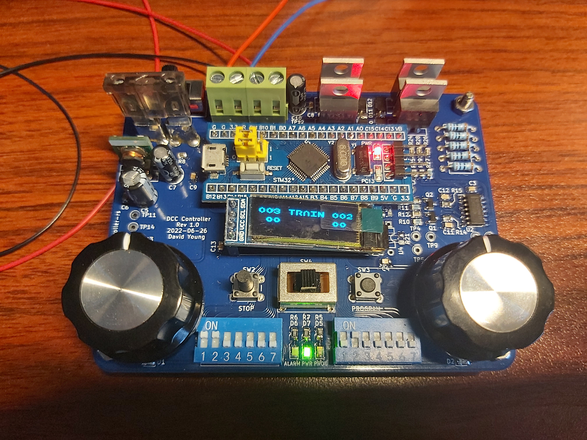

# dcc-controller-rs
Open source lightweight DCC controller with firmware written in Rust

Based on the STM32F103C8T6 "blue pill" board - specifically the C8 version
rather than the C6 because the former has 64k of flash, and the graphics
components push the binary size up to around 51k.

## Features
* Two control potentiometers to control two locomotives, with short-mode
addresses selected via dipswitches
* Potentiometers are centre-off; rotate left to drive the corresponding
locomotive in reverse, and right to drive it forwards
* LED for each channel to show when it is active
* On-off-on mini slide switch to select programming mode
  * programming mode disables all control functions and just sends out
DCC IDLE packets until the "program" button is pressed
  * Controller will then send out the programming sequence to program the
locomotive with the address set on the selected channel
* Current measurement and overcurrent shut-off
* Overcurrent alarm LED
* Screw terminals to connect power supply and track outputs
* Pure-Rust open source firmware based on dcc-rs
* Open source hardware

# License
Source code for the software components is distributed under the terms
of the Mozilla Public License Version 2.0.

Design files for the hardware components are distributed under the terms
of the CERN Open Hardware Licence Version 2 - Weakly Reciprocal.
